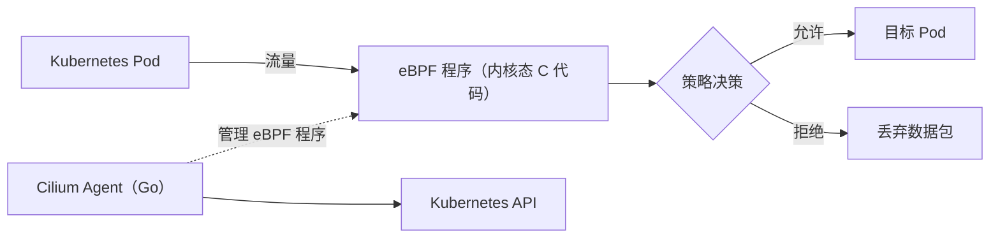

Cilium 是一个基于 **eBPF (Extended Berkeley Packet Filter)** 技术构建的高性能网络、可观测性和安全解决方案，其开发主要涉及以下技术和编程语言：

---

### **1. 核心开发语言**
- **Go (Golang)**  
  - Cilium 的主体代码（包括控制平面和用户空间工具）使用 Go 编写，原因包括：  
    - 高性能的并发模型（Goroutines + Channels）适合网络数据处理。  
    - 丰富的标准库支持网络和系统编程。  
    - 与 Kubernetes 生态无缝集成（Kubernetes 本身用 Go 开发）。  

- **C**  
  - eBPF 程序（运行在内核空间的代码）必须用 C 编写，因为：  
    - Linux 内核的 eBPF 虚拟机仅支持 C 的子集（通过 LLVM 编译为 eBPF 字节码）。  
    - 需要精细控制内存和性能优化。  

---

### **2. 关键技术组件**
| **组件**               | **技术栈**                  | **作用**                                   |
|------------------------|----------------------------|-------------------------------------------|
| **eBPF 程序**          | C + LLVM 编译              | 内核态高性能数据包处理、安全策略执行       |
| **控制平面（Cilium Agent）** | Go                         | 管理 eBPF 程序、API 交互、策略分发         |
| **数据平面**           | eBPF（内核态）             | 直接处理网络流量（绕过传统内核协议栈）     |
| **CLI 工具（cilium）** | Go                         | 用户交互、调试和运维                      |
| **Kubernetes CRD**     | Go + Kubernetes API 库     | 定义网络策略、服务映射等自定义资源         |

---

### **3. 关键依赖与工具**
- **eBPF 工具链**  
  - **LLVM**：将 C 代码编译为 eBPF 字节码。  
  - **libbpf**：加载和管理 eBPF 程序的用户空间库。  
  - **BPF Compiler Collection (BCC)**：早期工具链（Cilium 现已转向 libbpf）。  

- **网络与容器技术**  
  - **Kubernetes**：Cilium 的核心编排平台。  
  - **Envoy**（可选）：用于 L7 代理（通过 eBPF 扩展）。  
  - **gRPC**：控制平面组件间通信。  

- **测试与调试**  
  - **Cilium 的 eBPF 测试框架**：验证内核态代码。  
  - **Ginkgo**：Go 的 BDD 测试框架。  

---

### **4. 为什么选择这些技术？**
| **技术** | **优势**                                                                 |
|----------|--------------------------------------------------------------------------|
| **eBPF** | 内核态可编程，零拷贝高性能，安全沙箱，动态加载（无需重启内核或服务）。     |
| **Go**   | 并发友好，内存安全，适合分布式系统，与 Kubernetes 生态完美契合。           |
| **C**    | 唯一可直接编写 eBPF 程序的语言，满足内核开发需求。                         |

---

### **5. 架构示例**

---

### **6. 开发贡献**
- **代码仓库**：  
  - GitHub: [cilium/cilium](https://github.com/cilium/cilium)（Go 为主）  
  - eBPF 程序位于 [`bpf/` 目录](https://github.com/cilium/cilium/tree/master/bpf)。  

- **构建要求**：  
  - Go 1.20+  
  - LLVM 12+  
  - Linux 内核 4.19+（支持 eBPF）  

---

### **总结**
Cilium 通过 **Go（用户空间） + C（eBPF 内核程序）** 的组合，利用 eBPF 技术实现了高性能的网络、安全和可观测性功能，成为云原生领域（如 Kubernetes）的核心网络方案之一。其设计充分结合了 Go 的工程化优势和 C 的低层控制能力。
